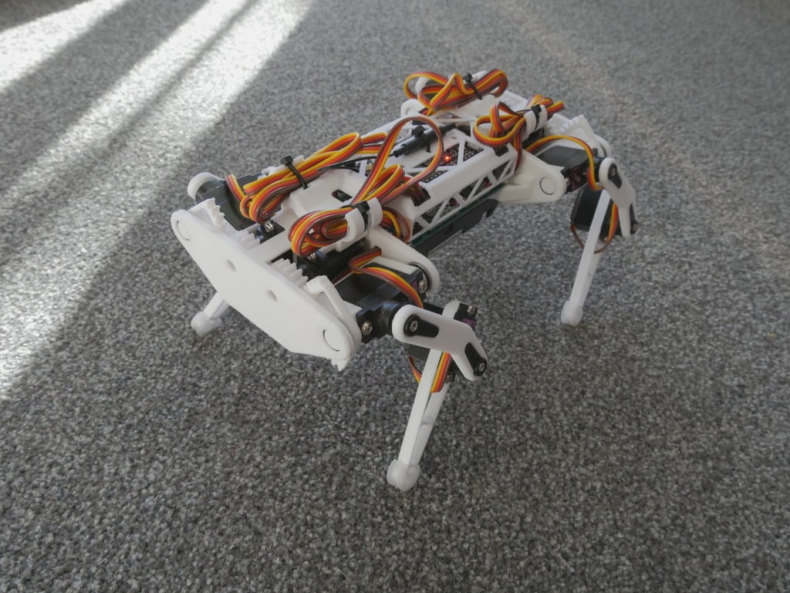

# 🐾 Weefee Project

A complete quadruped robot control system built on ESP32 (using ESP-IDF v5.4.1 + micro-ROS) and ROS 2 Jazzy, featuring inverse kinematics, multiple gait patterns, and ROS2 visualization.



## 🤖 Hardware Reference

This project is based on the [ESP32 Small Robot Dog](https://www.instructables.com/ESP32-Small-Robot-Dog/) design. The default physical implementation uses the 3D printable parts and assembly instructions from:
- 3D printing files: [Thingiverse](https://www.thingiverse.com/thing:4822059)
- Hardware documentation: [GitHub Repository](https://github.com/SovGVD/esp32-small-robot-dog-hardware)

This affordable and accessible quadruped platform provides an excellent foundation for experimenting with ROS2 and robotics control systems. While the default implementation follows this design, the software is adaptable to other quadruped models with appropriate configuration.

## ✨ Key Features

- **Inverse & Forward Kinematics** - Precise leg position control
- **Multiple Gait Patterns** - Stand, walk, trot, and pace
- **Body Position & Orientation Control** - Full 6DOF body manipulation
- **Battery Monitoring System** - Real-time battery tracking with safety features
- **ROS2 Visualization** - 3D visualization in RViz
- **Optimized ESP32 Communication** - Efficient single-channel communication with diagnostic capabilities

## 🧠 System Architecture

The system operates using two main communication components:
1. **ROS2 Node (servo_commander)**: Controls the robot via a single topic (`/robot_command`) and provides diagnostics via the `/servo_angles` topic for visualization.
2. **ESP32 Firmware**: Handles servo control, kinematics, and movement patterns.

### Communication Flow

```
[ROS2 Node] -- /robot_command --> [ESP32] -- robot actions --> [Physical Robot]
    |                               |
    |                               |
    v                               v
[Diagnostics & Visualization]   [Status Updates]
      (/servo_angles)           (/robot_status)
```

This optimized architecture uses a single primary command channel (`/robot_command`) rather than multiple separate channels, reducing overhead on the ESP32 and improving overall performance.

## 🔄 Recent Optimizations

The communication system has been significantly improved:

- **Reduced Channel Complexity**: Consolidation of multiple message channels into a single robust command path
- **Improved ESP32 Performance**: Removal of redundant subscriptions, freeing up resources for critical operations
- **Enhanced Visualization**: Maintained diagnostic capabilities while reducing ESP32 overhead by moving visualization publishing to the ROS2 side
- **Seamless Command Handling**: Unified command handling via the `/robot_command` topic with consistent methods for all operations

Benefits include better responsiveness, reduced resource consumption, and a more maintainable codebase. For details, see the [ESP32 Optimization](https://github.com/xelfe/weefee_project/wiki/ESP32-Optimization) documentation.

## 🚀 Quick Start

### Prerequisites

- ESP-IDF v5.4.1 (other versions are not guaranteed to work)
- ROS 2 Jazzy Jalisco (Ubuntu 24.04)
- micro-ROS for ESP-IDF v5.4.1

### 1. Clone the repository

```bash
git clone --recurse-submodules https://github.com/xelfe/weefee_project.git
cd weefee_project
```

### 2. Build & Flash ESP32 Firmware

```bash
cd espidf/weefee_esp32
. $HOME/esp/esp-idf/export.sh  # Make sure this points to ESP-IDF v5.4.1
idf.py build
idf.py -p /dev/ttyUSB0 flash
```

### 3. Build ROS2 Workspace

```bash
cd ../../ros2_ws
source /opt/ros/jazzy/setup.bash  # Specifically using ROS 2 Jazzy
colcon build
source install/setup.bash
```

### 4. Run the System

Terminal 1 - Start micro-ROS Agent:
```bash
source /opt/ros/jazzy/setup.bash
ros2 run micro_ros_agent micro_ros_agent udp4 --port 8888
```

Terminal 2 - Run Kinematics Controller:
```bash
source /opt/ros/jazzy/setup.bash
source install/setup.bash
ros2 run weefee_node quadruped_kinematics_controller
```

Terminal 3 (Optional) - Run Visualizer with RViz:
```bash
source /opt/ros/jazzy/setup.bash
source install/setup.bash
ros2 run weefee_node quadruped_visualizer
```

## 📚 Documentation

For detailed documentation, including installation instructions, code structure, and usage guides, please refer to our comprehensive wiki:

- [Project Wiki](https://github.com/xelfe/weefee_project/wiki)
- [Getting Started Guide](https://github.com/xelfe/weefee_project/wiki/Getting-Started)
- [Command Reference](https://github.com/xelfe/weefee_project/wiki/Command-Reference)
- [Kinematics Documentation](https://github.com/xelfe/weefee_project/wiki/Kinematics)
- [Battery Monitoring System](https://github.com/xelfe/weefee_project/wiki/Battery-Monitoring)
- [ESP32 Optimization](https://github.com/xelfe/weefee_project/wiki/ESP32-Optimization)

## 📖 Basic Commands

Control your robot with these basic ROS2 commands:

```bash
# Make the robot stand
ros2 topic pub --once /robot_command std_msgs/msg/String "{data: 'stand'}"

# Start walking at normal speed
ros2 topic pub --once /robot_command std_msgs/msg/String "{data: 'walk'}"

# Stop all movement
ros2 topic pub --once /robot_command std_msgs/msg/String "{data: 'stop'}"

# Calibration mode for assembly (sets servos to 90°, 45°, 90° positions)
ros2 topic pub --once /robot_command std_msgs/msg/String "{data: 'calibrate'}"

# Send direct servo positions (12 angles, one for each servo)
ros2 topic pub --once /robot_command std_msgs/msg/String "{data: 'servo:90,45,90,90,45,90,90,45,90,90,45,90'}"

# View servo angles during operation (diagnostic visualization)
ros2 topic echo /servo_angles
```

## 🛠️ Project Structure

- **espidf/** – ESP32 firmware with micro-ROS integration
  - **weefee_esp32/main/** - Core ESP32 code with optimized ROS2 communication
- **ros2_ws/** – ROS2 workspace with control nodes
  - **src/weefee_node/src/servo_commander.cpp** - Main controller with unified command interface

## 📄 License

This project is licensed under the MIT License - see the [LICENSE](LICENSE) file for details.

## 👨‍💻 Development

This project is developed collaboratively with the assistance of AI (GitHub Copilot) to ensure efficient and robust solutions for quadruped robot control.

## 🔄 Last Updated

May 13, 2025